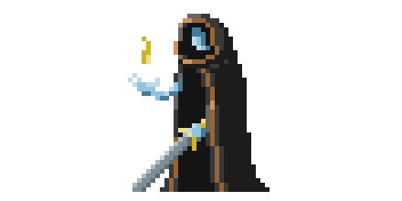

  
# Hi there 👋

I Love the programming language C and have been programming in it for more than 5 years and am now a C/C++ tutor)

I'm studying Applied Mathematics and Computer Science at ITMO University.   

 

---
Technology stack:
* **C/C++** - sufficient knowledge for advanced programming
* **Qt** - sufficient knowledge for programming simple apps
* **Java**, **JavaScript** (Junior) - sufficient knowledge for programming algorithms
* **Python** (Junior) - programmed neural networks and did data processing with it
* **Clojure**, **HTML/CSS** (Basic) - basic knowledge from university course

Other useful skills:
* IoT dev - Arduino/ESP - [CanSat](http://roscansat.com/) finalist team (2019)
* Git, Cmake, Markdown - widespread use
* Neural Networks for python (Basic)
* English level A2, Pre-Intermediate
* Teamwork - captain of the command many times

- OpenMP, Windows api (COM-Port, TCP), UTF-8/16/32, JSON
  
---

Links:
* Mail:       [verenya08@gmail.com](mailto:verenya08@gmail.com) 
* Telegram:   [Andrey_Verenya](https://t.me/Andrey_Verenya)
* Code-forces: [Nomadict](https://codeforces.com/profile/Nomadict)
* [RESUME](https://shorturl.at/ovAR1)

---
<!---

  

 
--->

  
